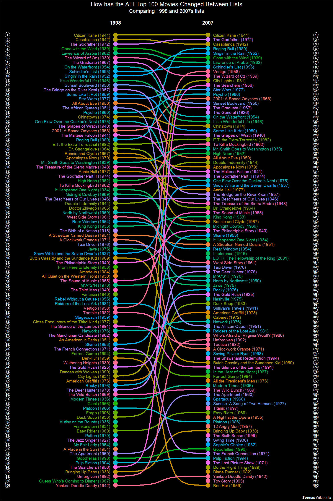

AFI Top 100 List Changes 1998 - 2007
================

This is a expanded version of the visualization of what is hosted on [my
blog](https://jlaw.netlify.app) to include all 100 movies rather than
just a limited set of the Top 30.

The American Film Institute released a list of the [Top 100 American
movies in
1998](https://en.wikipedia.org/wiki/AFI%27s_100_Years...100_Movies). For
the 10th Anniversary they released an updated list. This is how those
lists differ from each other:

<!-- -->
